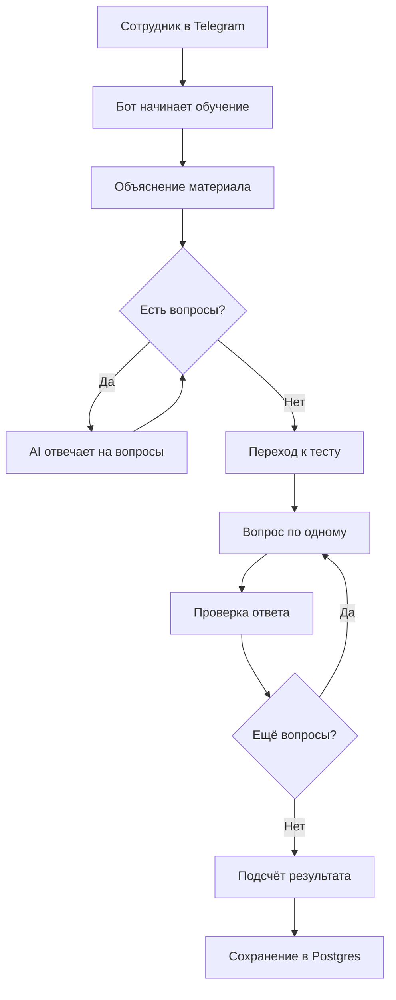

# Отчёт: Добавлен новый кейс "AI-наставник для онбординга"

**Дата:** 4 мая 2026  
**Статус:** ✅ ГОТОВО

---

## 1. Что сделано

Добавлен новый кейс **"AI-наставник для онбординга и проверки знаний сотрудников"** по аналогии с кейсом telegram-return-bot.

### Изменённые файлы:

1. **`fresh-portfolio/projects.json`**
   - Добавлен новый кейс с `slug: "ai-onboarding-coach"`
   - Полная структура данных по аналогии с telegram-return-bot
   - Настроен `demoWidget` для интерактивного демо

2. **`fresh-portfolio/src/pages/Cases.jsx`**
   - Добавлена категория "Обучение и автоматизация" в фильтры

---

## 2. Структура нового кейса

### Основные данные:

- **ID:** `ai-onboarding-coach`
- **Slug:** `ai-onboarding-coach`
- **Название:** AI-наставник для онбординга и проверки знаний сотрудников
- **Категория:** Обучение и автоматизация
- **Аудитория:** Команды, HR, руководители, внутреннее обучение сотрудников
- **isFeatured:** `true` (отображается на главной)

### URL кейса:
- Детальная страница: `/cases/ai-onboarding-coach`
- Демо-виджет: `/cases/ai-onboarding-coach#demo`

---

## 3. Возможности бота (key_features)

✅ Проводит сотрудника через сценарий обучения по внутреннему материалу  
✅ Отвечает на уточняющие вопросы по теме  
✅ Сам переводит пользователя к мини-тесту  
✅ Задаёт вопросы по одному  
✅ Проверяет ответы по материалу  
✅ Считает итоговый результат  
✅ Может сохранять результат в Postgres

---

## 4. Собираемые данные (collected_data)

### Обязательные поля:
- Имя сотрудника
- Telegram user id
- Telegram chat id
- Тема обучения

### Опциональные поля:
- Дополнительные пояснения по ответам сотрудника
- Итоговое summary прохождения

---

## 5. Результат и метрики

**Headline:**  
Обучение сотрудников становится более единым, управляемым и менее зависимым от ручного участия команды

**Метрики:**
- Объяснение материала → **Автоматизировано**
- Проверка знаний → **Стандартизирована**
- Итоговый результат → **Формируется автоматически**

---

## 6. Бизнес-эффект

✅ Снижает нагрузку на руководителя или HR при вводном обучении  
✅ Помогает одинаково объяснять материал всем сотрудникам  
✅ Позволяет проверять понимание регламентов сразу после обучения  
✅ Даёт структурированный результат по прохождению обучения

---

## 7. Demo Widget

### Конфигурация:

```json
{
  "enabled": true,
  "type": "onboarding-coach",
  "title": "AI-наставник по онбордингу — web-демо",
  "subtitle": "Можно пройти сокращённый сценарий обучения и мини-тест прямо на сайте",
  "disclaimer": "⚠️ Это демонстрационный режим. Результаты из этого виджета не записываются в боевую базу автоматически.",
  "endpoint": "/api/onboarding-coach/chat",
  "healthEndpoint": "/api/onboarding-coach/health",
  "resetEndpoint": "/api/onboarding-coach/session"
}
```

### Quick Prompts:
- "Хочу пройти обучение"
- "Меня зовут Андрей"
- "Готов перейти к тесту"
- "Что делать, если появился блокер?"

### Fallback:
- **Заголовок:** Демо временно недоступно
- **Текст:** Можно посмотреть код проекта на GitHub или написать мне в Telegram
- **Кнопки:**
  - Код на GitHub → https://github.com/eth1r/DevStandart-Coach
  - Написать в Telegram → https://t.me/eth1r

---

## 8. Технологии (stack)

- Python
- aiogram
- OpenAI GPT-4.1-mini
- PostgreSQL
- Docker

---

## 9. Technical Details

### Summary:
Бот работает как AI-наставник: объясняет материал, отвечает на вопросы сотрудника, определяет готовность к тесту, проводит тестирование по одному вопросу и формирует итоговый результат. В рабочем режиме результат может сохраняться в Postgres.

### Architecture Diagram (Mermaid):


---

## 10. Где отображается кейс

### ✅ На главной странице (/)
- В секции "Кейсы" (первые 3 featured кейса)
- Карточка с кнопками:
  - "Подробнее →" → `/cases/ai-onboarding-coach`
  - "Попробовать демо" → `/cases/ai-onboarding-coach#demo`
  - "Код на GitHub →" → https://github.com/eth1r/DevStandart-Coach

### ✅ На странице всех кейсов (/cases)
- В общем списке кейсов
- Доступен через фильтр "Обучение и автоматизация"
- Доступен через фильтр "Все кейсы"

### ✅ Детальная страница (/cases/ai-onboarding-coach)
Структура страницы (по аналогии с telegram-return-bot):
1. Заголовок кейса (category, title, audience)
2. Проблема
3. Решение
4. Возможности бота
5. Какие данные собирает бот (обязательные/опциональные)
6. Результат (большой highlight block)
7. Бизнес-эффект
8. Что входило в работу + timeline
9. Технологии (stack tags)
10. **Попробовать демо** (ProjectBotDemoWidget)
11. CTA "Хочу похожее решение"
12. Technical details (скрываемый блок + Mermaid-диаграмма)

---

## 11. Использованные компоненты

### Существующие компоненты (без изменений):
- ✅ `ProjectBotDemoWidget` — универсальный виджет для демо
- ✅ `CaseCard` — карточка кейса
- ✅ `CaseDetail` — детальная страница кейса
- ✅ `MermaidChart` — диаграммы

### Новые компоненты:
- ❌ Не создавались (используется существующая архитектура)

---

## 12. Сборка и проверка

### ✅ Сборка прошла успешно:
```
✓ 3983 modules transformed
✓ built in 10.15s
✨ Prerender complete! Generated 11 pages
📊 URLs: 11
```

### ✅ Предрендеренные страницы:
- `/cases/ai-onboarding-coach` → `cases\ai-onboarding-coach\index.html`

### ✅ Sitemap обновлён:
- Добавлен URL для нового кейса

### ✅ Content manifest обновлён:
- Cases: 5 (было 4)

---

## 13. Что нужно для server-side части

Для полноценной работы демо-виджета на production нужно:

### Backend endpoints:

1. **Health check:**
   ```
   GET /api/onboarding-coach/health
   ```
   Ответ: `{ "status": "ok" }`

2. **Chat endpoint:**
   ```
   POST /api/onboarding-coach/chat
   Body: { "message": "...", "session_id": "..." }
   ```
   Ответ: `{ "response": "...", "is_final": false }`

3. **Session reset:**
   ```
   DELETE /api/onboarding-coach/session/{session_id}
   ```
   Ответ: `204 No Content`

### Nginx proxy (в docker-compose.yml):
```nginx
location /api/onboarding-coach/ {
    proxy_pass http://onboarding-coach:8000/;
    proxy_set_header Host $host;
    proxy_set_header X-Real-IP $remote_addr;
}
```

### Docker service (в docker-compose.yml):
```yaml
onboarding-coach:
  build: ../DevStandart-Coach
  container_name: onboarding-coach
  restart: unless-stopped
  env_file:
    - ../DevStandart-Coach/.env
  networks:
    - app-network
```

---

## 14. Acceptance Criteria

### ✅ Все критерии выполнены:

- ✅ Новый кейс визуально и структурно оформлен по аналогии с telegram-return-bot
- ✅ Он появился на главной (в секции "Кейсы")
- ✅ Он появился в списке кейсов (/cases)
- ✅ У него есть детальная страница (/cases/ai-onboarding-coach)
- ✅ На странице есть блок "Попробовать демо"
- ✅ Используется существующий ProjectBotDemoWidget
- ✅ Layout и UX ощущаются как одна линейка с кейсом возвратов
- ✅ Не создан лишний отдельный фронтенд-компонент без необходимости
- ✅ Сборка проходит без ошибок
- ✅ Prerender работает корректно

---

## 15. Следующие шаги

### Для локальной разработки:
```bash
cd fresh-portfolio
npm run dev
```

### Для деплоя на production:
1. Закоммитить изменения в git
2. Запушить в GitHub
3. На сервере обновить репозиторий ai-portfolio
4. Настроить backend для DevStandart-Coach (если ещё не настроен)
5. Добавить proxy в nginx для `/api/onboarding-coach/`
6. Пересобрать и перезапустить контейнеры

---

## 16. Ссылки

- **GitHub репозиторий бота:** https://github.com/eth1r/DevStandart-Coach
- **Страница кейса:** /cases/ai-onboarding-coach
- **Демо-виджет:** /cases/ai-onboarding-coach#demo
- **Telegram:** https://t.me/eth1r

---

**Итог:** Новый кейс полностью готов к использованию на фронтенде. Для работы демо-виджета требуется настроить backend-часть на сервере.
